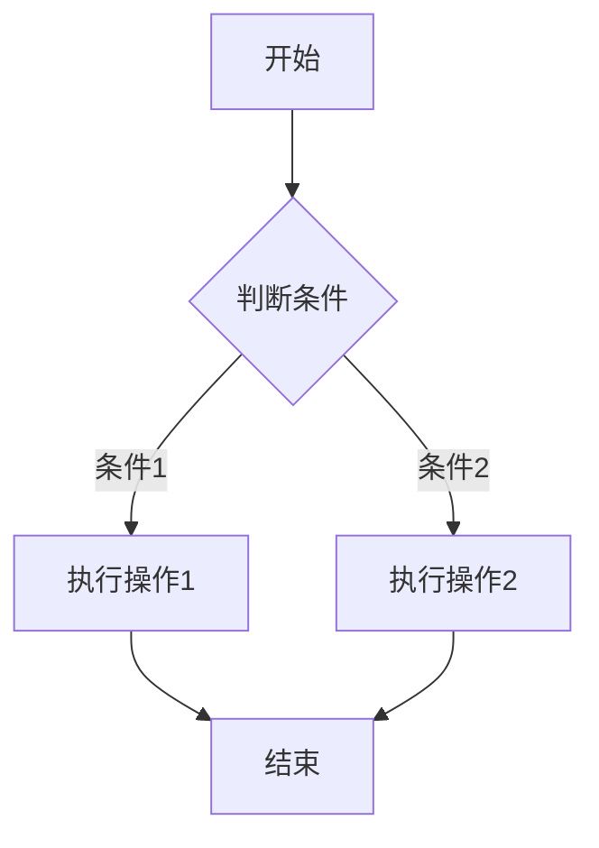
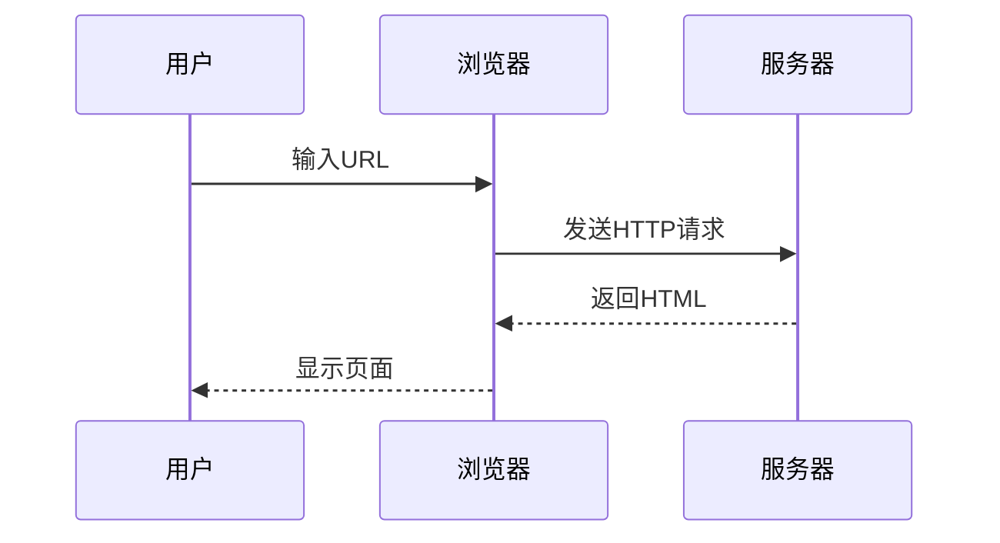
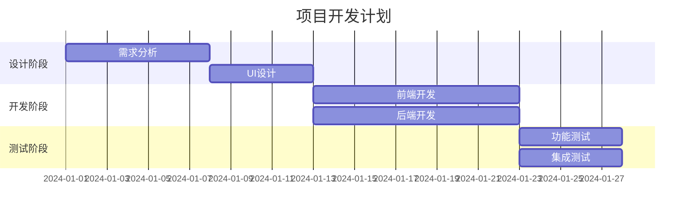
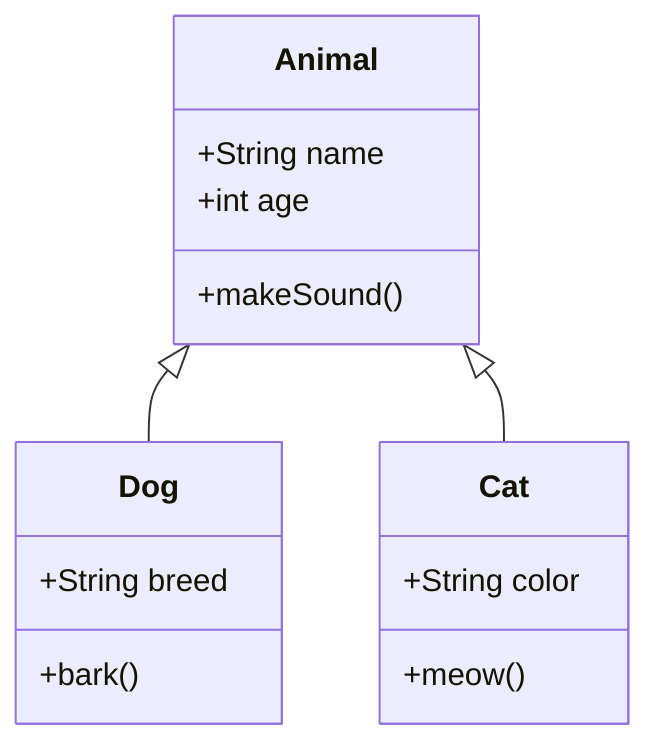
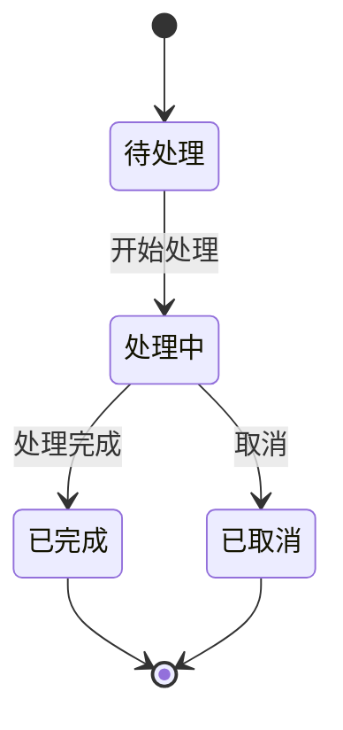
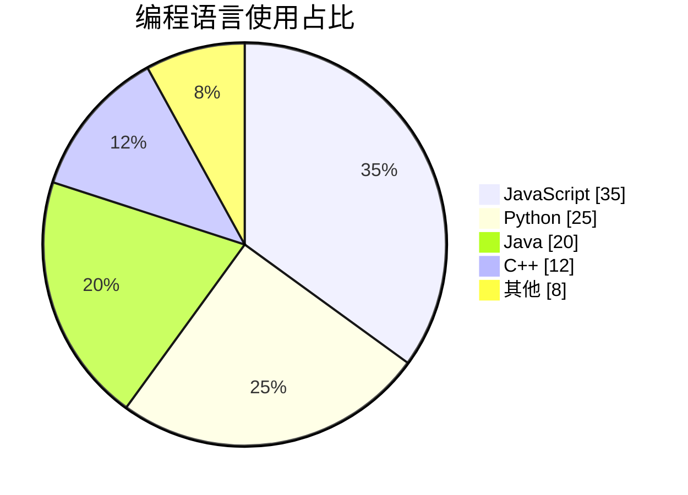
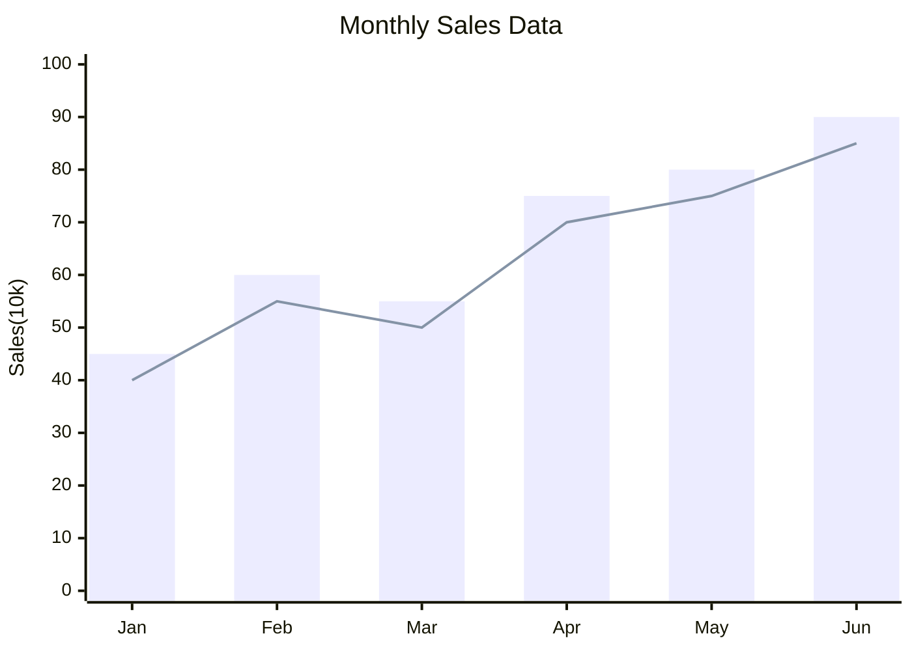
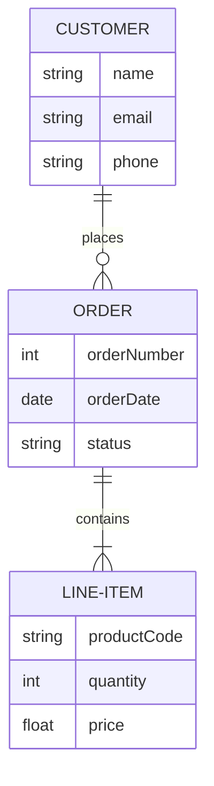
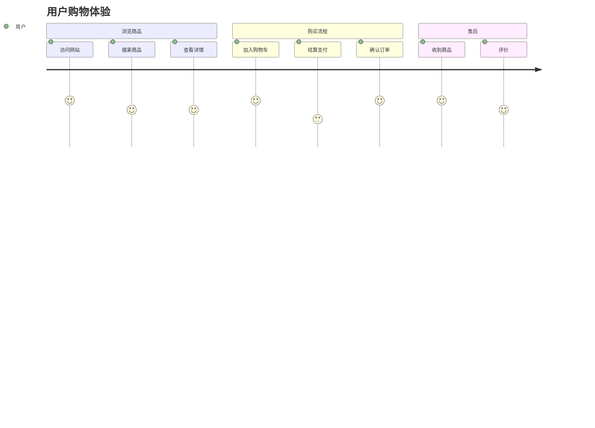

# Markdown 格式测试文档

## 1. 标题测试

# 一级标题 H1
## 二级标题 H2
### 三级标题 H3
#### 四级标题 H4
##### 五级标题 H5
###### 六级标题 H6

---

## 2. 文本格式

**粗体文本**

*斜体文本*

***粗斜体文本***

~~删除线~~

下划线文本（HTML）: <u>下划线</u>

上标: X<sup>2</sup>

下标: H<sub>2</sub>O

---

## 3. 列表

### 无序列表
- 项目 1
- 项目 2
  - 子项目 2.1
  - 子项目 2.2
    - 子子项目 2.2.1
- 项目 3

### 有序列表
1. 第一项
2. 第二项
   1. 子项 2.1
   2. 子项 2.2
3. 第三项

### 任务列表（GFM）
- [x] 已完成任务
- [x] 另一个已完成任务
- [ ] 未完成任务
- [ ] 待办事项

---

## 4. 链接和图片

### 链接
[Google](https://www.google.com)

[带标题的链接](https://www.github.com "GitHub官网")

自动链接: https://www.example.com

### 图片


---

## 5. 引用

> 这是一个引用块
> 
> 可以有多行内容
> 
> > 嵌套引用
> > 
> > > 多层嵌套

---

## 6. 代码

### 行内代码
这是 `行内代码` 示例。

### 代码块（带语法高亮）

```javascript
// JavaScript 示例
function hello(name) {
  console.log(`Hello, ${name}!`);
  return true;
}

const result = hello('World');
```

```python
# Python 示例
def fibonacci(n):
    if n <= 1:
        return n
    return fibonacci(n-1) + fibonacci(n-2)

print(fibonacci(10))
```

```css
/* CSS 示例 */
.container {
  display: flex;
  justify-content: center;
  align-items: center;
  background: linear-gradient(45deg, #ff6b6b, #4ecdc4);
}
```

```html
<!-- HTML 示例 -->
<!DOCTYPE html>
<html>
<head>
  <title>示例页面</title>
</head>
<body>
  <h1>Hello World</h1>
</body>
</html>
```

---

## 7. 表格（GFM）

| 姓名 | 年龄 | 职业 |
|------|------|------|
| 张三 | 28 | 工程师 |
| 李四 | 32 | 设计师 |
| 王五 | 25 | 产品经理 |

### 对齐表格
| 左对齐 | 居中对齐 | 右对齐 |
|:-------|:--------:|-------:|
| 内容1  | 内容2    | 内容3  |
| A      | B        | C      |
| 长文本内容 | 中等文本 | 短文本 |

---

## 8. 分隔线

方式 1:
***

方式 2:
---

方式 3:
___

---

## 9. 数学公式（LaTeX）

### 行内公式
这是行内公式: $E = mc^2$

爱因斯坦质能方程: $E = mc^2$

二次方程: $ax^2 + bx + c = 0$

### 块级公式

$$
\frac{-b \pm \sqrt{b^2 - 4ac}}{2a}
$$

$$
\sum_{i=1}^{n} i = \frac{n(n+1)}{2}
$$

$$
\int_{a}^{b} f(x)dx = F(b) - F(a)
$$

$$
\begin{bmatrix}
a & b \\
c & d
\end{bmatrix}
$$

---

## 10. 转义字符

\*不是斜体\*

\#不是标题

\[不是链接\]

\\反斜杠

---

## 11. HTML 内容

<div style="color: red; font-weight: bold;">
  这是红色粗体文本（使用 HTML）
</div>

<details>
<summary>点击展开/折叠</summary>

这是隐藏的内容，点击上面的标题可以展开或折叠。

可以包含任何 Markdown 内容：
- 列表项 1
- 列表项 2

</details>

---

## 12. Emoji 表情

:smile: :heart: :thumbsup: :rocket: :fire:

😀 😃 😄 😁 🎉 🎊 ✨ 🚀 💖

---

## 13. 脚注

这是一个带脚注的文本[^1]。

这是另一个脚注[^note]。

[^1]: 这是第一个脚注的内容。
[^note]: 这是命名脚注的内容。

---

## 14. 定义列表

术语 1
: 定义 1

术语 2
: 定义 2a
: 定义 2b

---

## 15. 缩写

HTML 是 Hypertext Markup Language 的缩写。

*[HTML]: Hypertext Markup Language

---

## 16. 高亮文本

==高亮文本==（某些渲染器支持）

---

## 17. 流程图和图表（Mermaid）

### 流程图


### 序列图


### 甘特图


### 类图


### 状态图


### 饼图


### 柱状图


### ER图（实体关系图）


### 用户旅程图


### ECharts 饼图（高级配置）
```echarts
{
  "backgroundColor": "#212121",
  "title": {
    "text": "『晚晴幽草轩』访问来源",
    "subtext": "2019 年 6 月份",
    "x": "center",
    "textStyle": {
      "color": "#f2f2f2"
    }
  },
  "tooltip": {
    "trigger": "item",
    "formatter": "{a} <br/>{b} : {c} ({d}%)"
  },
  "legend": {
    "orient": "vertical",
    "left": "left",
    "data": [
      "搜索引擎",
      "直接访问",
      "推荐",
      "其他",
      "社交平台"
    ],
    "textStyle": {
      "color": "#f2f2f2"
    }
  },
  "series": [
    {
      "name": "访问来源",
      "type": "pie",
      "radius": "55%",
      "center": [
        "50%",
        "60%"
      ],
      "data": [
        {
          "value": 10440,
          "name": "搜索引擎",
          "itemStyle": {
            "color": "#ef4136"
          }
        },
        {
          "value": 4770,
          "name": "直接访问"
        },
        {
          "value": 2430,
          "name": "推荐"
        },
        {
          "value": 342,
          "name": "其他"
        },
        {
          "value": 18,
          "name": "社交平台"
        }
      ],
      "itemStyle": {
        "emphasis": {
          "shadowBlur": 10,
          "shadowOffsetX": 0,
          "shadowColor": "rgba(0, 0, 0, 0.5)"
        }
      }
    }
  ]
}
```

### ECharts 柱状图
```echarts
{
  "title": {
    "text": "月度销售数据对比"
  },
  "tooltip": {
    "trigger": "axis",
    "axisPointer": {
      "type": "shadow"
    }
  },
  "legend": {
    "data": ["实际销售", "目标销售"]
  },
  "xAxis": {
    "type": "category",
    "data": ["一月", "二月", "三月", "四月", "五月", "六月"]
  },
  "yAxis": {
    "type": "value"
  },
  "series": [
    {
      "name": "实际销售",
      "type": "bar",
      "data": [45, 60, 55, 75, 80, 90],
      "itemStyle": {
        "color": "#5470c6"
      }
    },
    {
      "name": "目标销售",
      "type": "bar",
      "data": [50, 65, 60, 70, 85, 95],
      "itemStyle": {
        "color": "#91cc75"
      }
    }
  ]
}
```

### ECharts 折线图
```echarts
{
  "title": {
    "text": "网站流量趋势"
  },
  "tooltip": {
    "trigger": "axis"
  },
  "xAxis": {
    "type": "category",
    "data": ["Mon", "Tue", "Wed", "Thu", "Fri", "Sat", "Sun"]
  },
  "yAxis": {
    "type": "value"
  },
  "series": [
    {
      "data": [820, 932, 901, 934, 1290, 1330, 1320],
      "type": "line",
      "smooth": true,
      "areaStyle": {},
      "itemStyle": {
        "color": "#ee6666"
      }
    }
  ]
}
```

---

## 总结

这个测试文档包含了几乎所有常见的 Markdown 格式：
- ✅ 标题（H1-H6）
- ✅ 文本格式（粗体、斜体、删除线）
- ✅ 列表（有序、无序、任务列表）
- ✅ 链接和图片
- ✅ 引用和嵌套引用
- ✅ 代码和语法高亮
- ✅ 表格（GFM）
- ✅ 分隔线
- ✅ 数学公式（LaTeX）
- ✅ 转义字符
- ✅ HTML 内容
- ✅ Emoji 表情
- ✅ 流程图（Mermaid）
- ✅ 序列图（Mermaid）
- ✅ 甘特图（Mermaid）
- ✅ 类图（Mermaid）
- ✅ 状态图（Mermaid）
- ✅ 饼图（Mermaid）
- ✅ 柱状图（Mermaid）
- ✅ ER图（Mermaid）
- ✅ 用户旅程图（Mermaid）
- ✅ ECharts 饼图（高级配置）
- ✅ ECharts 柱状图
- ✅ ECharts 折线图

**测试完成！** 🎉
